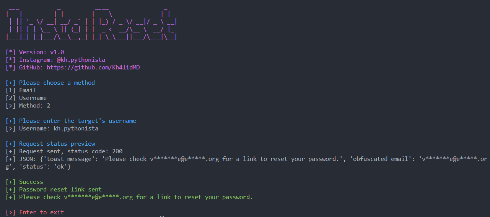

# InstaReset - _Forgot Instagram Password_ using Python !

## What is this?

This script was made to send a Instagram reset password request using Python **without asking for reCAPTCHA** as Instagram does if we used a browser.
 
It supports username and email methods.

 

## Features
- Faster ⚡
- No reCAPTCHA 🤖
- Nice looking CLI 🎨
- Works on mobile 📱

## Requirements
_in case you want to run the script quickly without the requirments and python just run the `main.exe` file_
- [Python 3.6+](https://www.python.org/downloads/)
- [Requests](https://pypi.org/project/requests/) module `pip install requests`
- [Colorama](https://pypi.org/project/colorama/) module `pip install colorama`

## Changelog

**v1.0**
- Initial release

## Module version
Coming soon...

 

_Liked the script? Leave a star ⭐ to show your support!_
